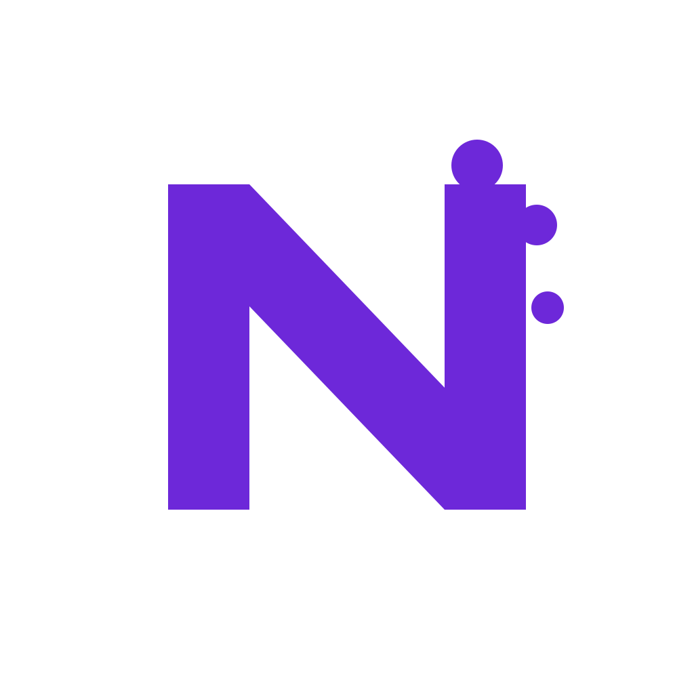

<!--
第0回は、AIをほとんど知らない人向けの入口資料です。
製品名は理解を助けるための例で、特定製品の推奨リストではありません。
公式ロゴ画像は使わず、製品名バッジと画面イメージで表現します。
-->

SESSION 00

# AIツールを使い始める前の基本

2026/05版AIチャット、AIエディタ、AIエージェントの最初の地図

～AI活用を始める現場に寄り添って、基本の考え方を案内します。～

<small class="cover-small">製品名は理解を助けるための例です。</small>

---

# 今日の案内役

  

    
現場でAI活用を始めるための、最初の相談役です。

    <ul class="profile-list">
      <li>名前: 佐伯 悠人（通称）</li>
      <li>所属: (株) NEURAMNESIA AI活用支援チーム</li>
      <li>経歴: AI推進室、事業会社のAI活用推進担当などを経験</li>
      <li>普段の仕事: Claude Codeを中心に、AIを使った業務改善や開発支援を提案・サポート</li>
      <li>今日の立ち位置: AIツールを一緒に試すための案内役</li>
      <li>困ったときの相談先: 弊社担当までお気軽にご相談ください</li>
    </ul>
    

      

        <strong>最近ハマっていること</strong>
        AIにあえて厳しめの質問をして、どこで間違えるか観察すること
      

      

        <strong>好きな仕事</strong>
        現場の「なんとなく面倒」を、少し楽にする仕組みを考えること
      

      

        <strong>大事にしていること</strong>
        すごさを押しつけるより、まず一緒に小さく試すこと
      

    

  

  

    

      
      
      
実はCodex推し😄

    

  

---

# 本日の流れ

  

    
1

    

      
使い始めるときのつまずき

      
何を聞けばいいか、どこまで信じていいか、なぜ不安になるか

    

  

  

    
2

    

      
AIの種類と使い方例

      
AIチャット / AIエディタ / AIエージェント / 複数AIを扱う作業環境

    

  

  

    
3

    

      
何から始めるのがよいのか

      
気軽な質問、作業としての依頼、業務改善で使える例

    

  

  

    
4

    

      
使用時のコツや注意

      
セッションの区切り方、避けたい操作、AIの返答の確認

    

  

  

    
5

    

      
今後と次回セッション

      
小さく試して、次のClaude Code説明会につなげる

    

  

---

# この回の目的

Claude Codeを使う前に、AIツール全般に共通する基本をそろえます。

  

    <strong>どう使うと役に立つか</strong>
    質問、整理、たたき台、レビュー観点など、最初に試しやすい使い方を知る。
  

  

    <strong>どこに注意するか</strong>
    機密情報、危険な操作、AIの間違い、裏取りの必要性を知る。
  

今日は特定ツールの操作説明ではなく、AIを業務で使うときの基本姿勢を扱います。

---

# 現場でよくあるつまずき

AIを使い始めるとき、最初につまずきやすい点があります。

  

    <strong>何を聞けばいいか分からない</strong>
    最初からうまいプロンプトを書こうとして止まってしまう。
  

  

    <strong>ツールの違いが分からない</strong>
    チャット、エディタ、エージェントの使い分けが見えにくい。
  

  

    <strong>どこまで信じていいか分からない</strong>
    もっともらしい回答と正しい回答の区別が難しい。
  

  

    <strong>業務で使うのは少し不安</strong>
    機密情報、権限、危険な操作が気になって踏み出しにくい。
  

---

# AIの種類と使い方例

「ツールの使い方がわからない」への回答です。

まずは、AIツールの種類と代表的な使い方を見ていきます。

---

# AIツールにも種類がある

同じ「AI」でも、できることや任せてよい範囲は違います。

  

    <strong>AIチャット</strong>
    質問、文章作成、アイデア出し、説明
  

  

    <strong>AIエディタ/IDE</strong>
    コード補完、小さな修正、コード説明
  

  

    <strong>AIエージェント</strong>
    作業の相談、リポジトリ調査、編集支援、コマンド実行支援
  

  

    <strong>複数AIを扱う作業環境</strong>
    複数エージェント、ツール連携、長めの作業管理
  

---

# AIチャットの例

ブラウザやアプリで質問するAIです。

  ChatGPT
  Claude
  Gemini
  Microsoft Copilot

User 
このエラーの原因候補を教えてください。  
AI 
考えられる原因は3つあります。まずログと設定値を確認しましょう。

機密情報や個人情報は、会社のルールに従って扱います。

---

# AIエディタ/IDEの例

エディタの中で、コード補完や小さな修正を支援するAIです。

  GitHub Copilot
  Cursor
  Kiro
  Windsurf

// エディタ上で相談 
この関数の責務を説明してください。 
この処理に対するテストケースを提案してください。

開いているフォルダやファイルの範囲を意識します。

---

# AIエージェントの例

ファイル調査、編集、コマンド実行の支援まで行うAIです。
CLI型と、アプリやチャット画面から頼めるタイプがあります。

  Claude Code
  Codex CLI
  Codex app
  Gemini CLI
  Copilot CLI
  Kiro CLI
  Kiro

入口の例 
CLI型: ターミナルから相談する 
アプリ型: 作業画面から依頼する 
チャット型: 会話しながら頼む

頼み方の例 
このバグの原因を調べてください。 
この機能を追加する方針を出してください。 
この修正をお願いします。

便利なぶん、起動場所、権限、作業範囲の確認が大切です。

---

# 複数AIを扱う作業環境の例

複数のAI、エージェント、ツールを1つの作業画面から扱う環境も増えています。

  Codex app
  Codex web
  Google Antigravity
  複数エージェント開発環境

  

    <strong>人間</strong>
    やりたいことを伝える
  

  
→

  

    

      <strong>プロジェクトA</strong>
      調査
    

    

      <strong>プロジェクトB</strong>
      修正
    

    

      <strong>プロジェクトC</strong>
      レビュー
    

  

  
→

  

    <strong>AIが作業</strong>
    調査、変更、実行を進める
  

  
→

  

    <strong>人間が確認</strong>
    結果を見て採用するか決める
  

見るポイントは、作業ごとにプロジェクトを分け、人間が最後に確認することです。

---

# 何から始めるのがよいのか

「何を聞けばいいか分からない」への回答です。

最初は、完璧な依頼ではなく、小さな相談から始めます。

---

# まずは気軽に聞いてみる

最初から完璧なプロンプトを書く必要はありません。

  

    <strong>説明してもらう</strong>
    この資料やコードの要点を説明してください。
  

  

    <strong>原因候補を出す</strong>
    このエラーや手戻りの原因候補を教えてください。
  

  

    <strong>進め方を整理する</strong>
    この作業の進め方を整理してください。
  

  

    <strong>観点を出す</strong>
    レビューや確認で見るべき観点を出してください。
  

---

# AIエージェントには作業として頼める

Codex app、Kiro、Claude Codeなどでは、
会話だけでなく作業単位で相談できます。

  

    <strong>機能追加</strong>
    この画面に検索機能を追加してください。
  

  

    <strong>バグ修正</strong>
    このエラーの原因を調べて、修正案を出してください。
  

  

    <strong>小さな変更</strong>
    この文言をユーザー向けに分かりやすく直してください。
  

  

    <strong>確認作業</strong>
    この差分で注意すべき点をレビューしてください。
  

最初は「いきなり変更」ではなく、調査と方針確認から始めると安心です。

---

# 業務改善で使える例

開発作業だけでなく、日々の業務の整理にも使えます。

  

    <strong>議事録の整理</strong>
    会議メモを要点、決定事項、宿題に分けて整理する。
  

  

    <strong>手順書のたたき台</strong>
    作業メモから、初めての人向けの手順書を作る。
  

  

    <strong>問い合わせ対応の下書き</strong>
    相手に伝わりやすい返信文や確認事項を整理する。
  

  

    <strong>FAQや改善案の整理</strong>
    よくある質問や困りごとから、改善の候補を出す。
  

最初は、機密情報を含まない小さな作業から試すと始めやすいです。

---

# 使用時のコツや注意

「どこまで信じていいか分からない」
「業務で使うのは少し不安」への回答です。

便利に使うために、最初に押さえたい注意点を見ていきます。

---

# うまく使うためのコツ

  

    <ul>
      <li>1回の相談（1セッション）は1つの目的に絞る</li>
      <li>長くなったら新しいセッションで相談し直す</li>
      <li>何をしてほしいかを書く</li>
      <li>何をしないでほしいかも書く</li>
      <li>変更前に方針を確認する</li>
    </ul>
  

  

よい依頼例 
変更はまだ行わず、 
構成、実行方法、テスト方法、 
注意点を整理してください。
  

AIは便利な相談相手ですが、丸投げ先ではありません。

---

# 最初に避けたいこと

慣れるまでは、取り消しにくい操作や影響範囲が大きい作業は任せません。

  

    <strong>危険なGit操作</strong>
    git reset / git clean / git rebase / force push
  

  

    <strong>削除や大量変更</strong>
    ファイル削除、ディレクトリ削除、大きなリファクタリング
  

  

    <strong>秘密情報</strong>
    .env、APIキー、トークン、秘密鍵
  

  

    <strong>本番環境</strong>
    本番環境、本番DB、戻しにくいデータ操作
  

迷ったら、その場で止めて確認します。

---

# AIの返答は鵜呑みにしない

AIは自然に見える文章で、間違ったことを言う場合があります。
また、こちらの意見に同意する方向で返ってくることがあります。

  

    <strong>参照先を見る</strong>
    AIが読んだファイルや情報が正しいか確認する。
  

  

    <strong>存在確認をする</strong>
    存在しない仕様やAPIを前提にしていないか見る。
  

  

    <strong>批判的な観点を頼む</strong>
    「問題点、リスク、反対意見も挙げて」と明示して聞く。
  

  

    <strong>テストとレビューで確認する</strong>
    もっともらしいだけでは採用しない。
  

「この方針でよいですか」だけでなく、「この方針の弱点も教えてください」と聞くのが大切です。

---

# これから小さく試していく

最初から完璧な使い方を決めるのではなく、
小さく試しながらチームで育てていきます。

  

    <strong>便利だった使い方を見つける</strong>
    他の人も真似しやすい使い方を少しずつ増やす。
  

  

    <strong>分かりにくかったことを集める</strong>
    あとでFAQや説明資料を育てる材料にする。
  

  

    <strong>つまずいたところを残す</strong>
    個人の失敗ではなく、チームの改善点として扱う。
  

  

    <strong>危なそうな提案を記録する</strong>
    ヒヤリハットとして残し、次の事故を防ぐ。
  

小さな気づきが、あとでチームの使い方を育てる材料になります。

---

# 次につなげる

第0回では、AIツール全般の見方をそろえました。

  <strong>次回: Claude Codeを安全に試す</strong>
  サンプルプロジェクトを使って、コードを書かせる前にプロジェクトを説明してもらう流れを見ます。

まずは、実装ではなく「調査」と「確認」から始めます。
