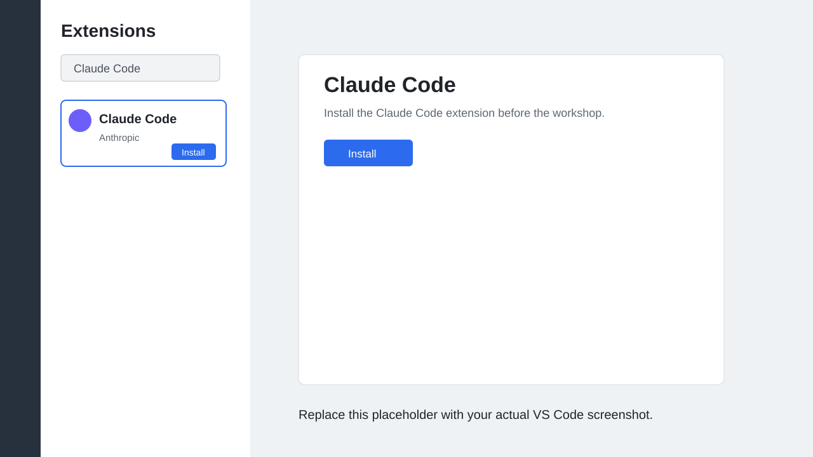
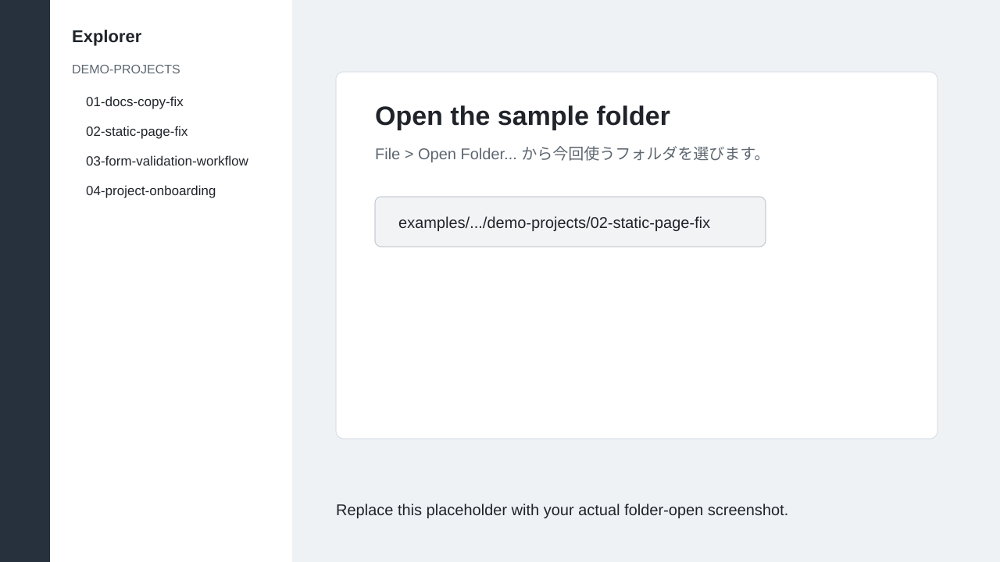
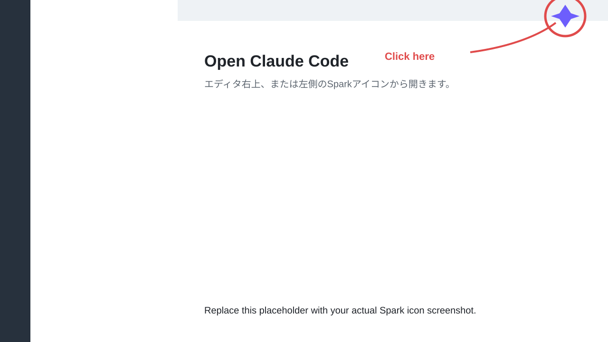
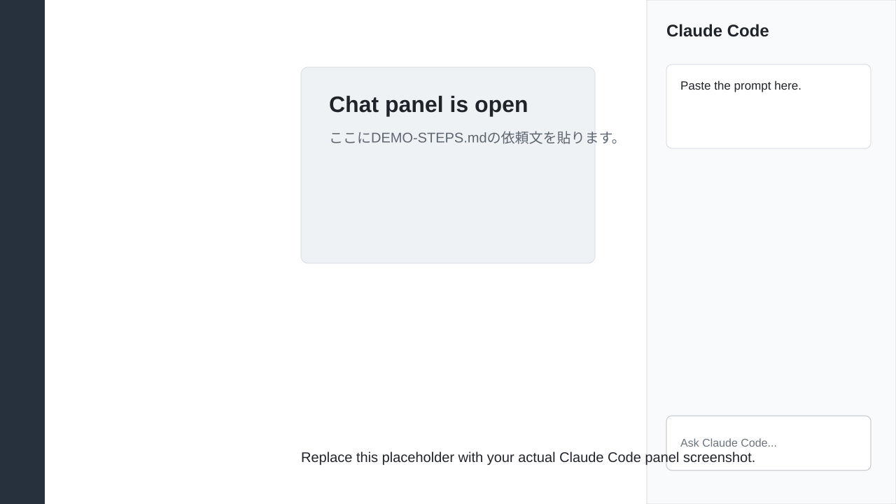
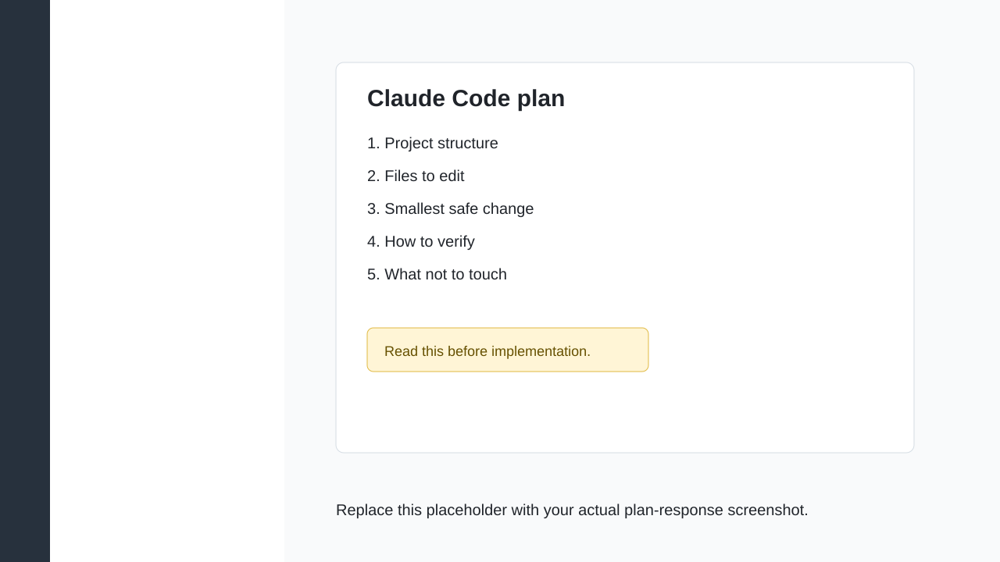
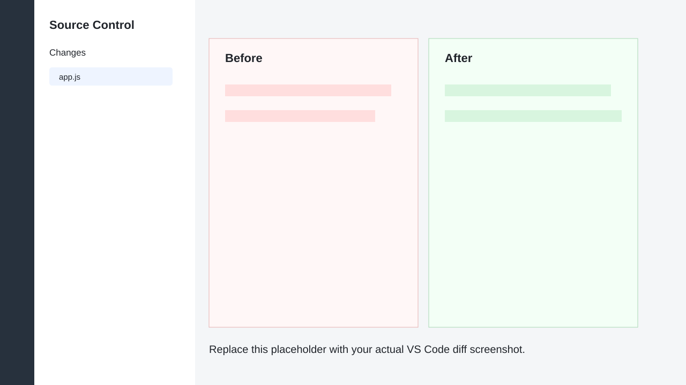
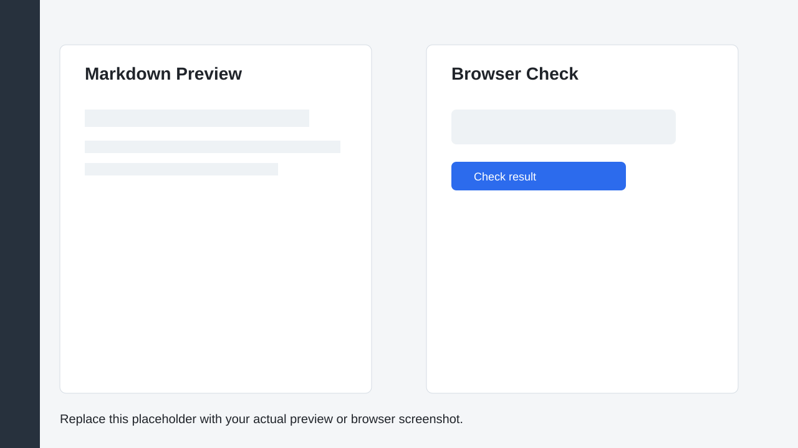
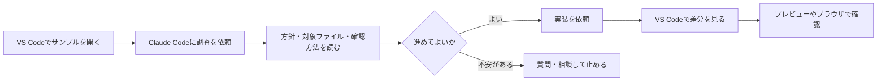

# 事前準備: VS CodeでClaude Codeを使う

この資料は、説明会に参加する前に読むスタートガイドです。

説明会では、Visual Studio Code と Claude Code extension を使って、AIエージェントへの依頼、方針確認、差分確認を練習します。

CLIやGitコマンドの細かい使い方は扱いません。まずは、VS Code上でClaude Codeを開き、依頼文を送り、変更内容を確認できる状態にします。

## この資料でできるようになること

- Claude Code extensionをインストールする
- VS Codeでサンプルフォルダを開く
- Claude Codeのチャット画面を開く
- 依頼文を送る
- AIが返した方針を読む
- VS Codeで変更差分を見る
- Markdownプレビューやブラウザで結果を確認する

## 1. Claude Code extensionをインストールする

1. VS Codeを起動する
2. 左側の拡張機能アイコンを開く
3. 検索欄で `Claude Code` を検索する
4. Claude Code拡張機能を選び、インストールする
5. インストール後、必要に応じてVS Codeを再読み込みする
6. 初回起動時にサインインを求められたら、自分のAnthropicアカウントでサインインする

補足: VS Codeは 1.98.0 以降が前提です。拡張機能が表示されない場合は、VS Codeを再起動するか、コマンドパレットから `Developer: Reload Window` を実行します。



## 2. サンプルフォルダを開く

1. VS Codeを起動する
2. `File` > `Open Folder...` を選ぶ
3. 説明会で使うサンプルフォルダを選ぶ
4. 左側のExplorerにファイル一覧が表示されることを確認する

説明会では、回ごとに次のフォルダを使います。

| 回 | 開くフォルダ |
| --- | --- |
| 第1回 | `01-docs-copy-fix` |
| 第2回 | `02-static-page-fix` |
| 第3回 | `03-form-validation-workflow` |
| 第4回 | `04-project-onboarding` |



## 3. Claude Codeのチャット画面を開く

1. Explorerで何か1つファイルを開く
2. エディタ右上の Spark アイコンをクリックする
3. Claude Codeのチャット画面が開くことを確認する

右上のアイコンが見えない場合は、次のどちらかで開きます。

- 左側のアクティビティバーにある Spark アイコンをクリックする
- `Ctrl+Shift+P` でコマンドパレットを開き、`Claude Code` と入力して開く





## 4. まずは変更せずに方針を聞く

Claude Codeが開いたら、いきなり実装を頼まず、まずは調査と方針だけを依頼します。

1. 各回の `DEMO-STEPS.md` を開く
2. 「最初に使う依頼文」をコピーする
3. Claude Codeの入力欄に貼り付ける
4. 送信する
5. AIが返した方針、触るファイル、確認方法を読む

ここでは、まだ実装させません。

内容が分からない場合は、次のように聞き返します。

```text
初心者にも分かるように、触るファイルと確認方法をもう少し短く説明してください。
```



## 5. 方針を確認してから実装を依頼する

AIの方針を読んで、問題なさそうであれば実装を依頼します。

1. 触るファイルが多すぎないか確認する
2. 変更内容が今回の目的に合っているか確認する
3. 確認方法が具体的か確認する
4. 問題なければ、`DEMO-STEPS.md` の「実装を依頼する文」をコピーする
5. Claude Codeの入力欄に貼り付ける
6. 送信する
7. AIの作業が終わるまで待つ

不安がある場合は、実装に進まず止めてください。

```text
この変更は少し不安です。
今回は実装せず、もっと小さく分ける案を出してください。
```

## 6. VS Codeで差分を見る

AIの作業が終わったら、説明だけで判断せず、必ず差分を確認します。

VS Codeの差分表示には、追加の拡張機能は不要です。

1. 左側の Source Control アイコンを開く
2. `Changes` に表示されたファイルを確認する
3. 変更されたファイルをクリックする
4. 左側が変更前、右側が変更後であることを確認する
5. 依頼していないファイルが変わっていないか見る

確認すること:

- 触る予定だったファイルだけが変わっているか
- 変更量が大きすぎないか
- 文言や動作が依頼と合っているか
- 削除や大きな移動が入っていないか



## 7. 結果を確認する

差分を見たあと、実際の表示や動作も確認します。

Markdownの場合:

1. `.md` ファイルを開く
2. 右上のプレビューアイコンをクリックする
3. 表示された文章を読む
4. 誤字や分かりにくい表現がないか確認する

HTMLの場合:

1. Explorerで `index.html` を右クリックする
2. ブラウザで開く
3. 画面表示やボタン操作を確認する
4. 修正前に起きていた問題が直っているか見る

ブラウザで開くメニューがない場合は、`index.html` をファイル一覧からダブルクリックしてブラウザで開いても構いません。



## 全体の流れ



## CLIを使う場合

この説明会では、VS Code + Claude Code extension を基本の進め方にします。

すでにCLI操作に慣れている人は、対象フォルダでClaude Codeを起動し、同じ依頼文を使って進めても構いません。ただし、説明会中の案内や画面例はVS Code前提です。

迷う場合は、VS Codeで進めてください。

## 画像について

この資料の画像は、差し替え前提のサンプルです。

実際の説明会では、自分の環境で撮った画面キャプチャに置き換えると、参加者がより迷いにくくなります。画像ファイルは [assets/vscode-claude-code-guide](./assets/vscode-claude-code-guide/README.md) に置いています。
